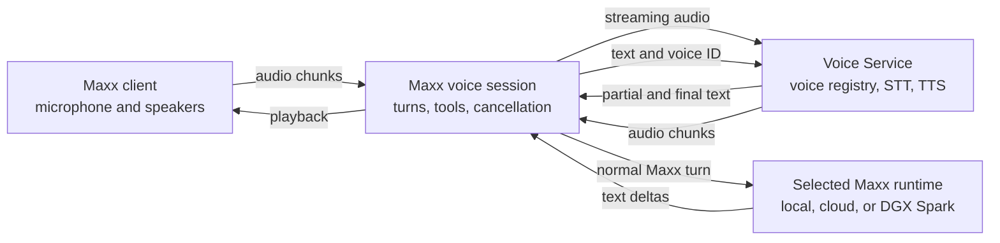

# Voice Architecture Plan

Date: 2026-08-18
Status: Phases 1–5 implemented; Phase 6 remains intentionally deferred

## Goal

Add familiar, provider-neutral voice functionality to Maxx without coupling the
application to MLX Audio, OpenAI, xAI, LiveKit, or any single speech model.

The first complete version will use a conventional speech pipeline:

```text
microphone -> speech-to-text -> selected Maxx runtime -> text-to-speech -> speakers
```

This keeps the selected Maxx model, thread, tools, approvals, browser access,
and canonical transcript in control of the conversation. It also allows local
speech models on the Mac mini to work with models hosted elsewhere, including
the DGX Spark cluster.

## Decision

Maxx will use three boundaries:

1. **Maxx owns conversation orchestration.** It owns turns, model selection,
   tools, interruption, state, persistence, and the canonical transcript.
2. **Speech providers own speech processing.** STT and TTS are replaceable
   provider adapters. Maxx connects directly to standard OpenAI-compatible
   audio APIs; its optional Voice Service is only needed when an underlying
   engine lacks named-voice discovery or another normalized capability.
3. **The client owns capture and playback.** The Maxx UI receiving microphone
   input also plays the response, even when STT, TTS, or LLM compute happens on
   another machine.

OpenAI-compatible audio routes are the initial interoperability convention:

- `POST /v1/audio/transcriptions`
- `POST /v1/audio/speech`
- `GET /v1/audio/voices` as a documented Maxx extension for voice discovery

For realtime operation, Maxx will normalize provider-specific messages into
its own small event model instead of exposing a vendor's wire format throughout
the application.

## System overview



In the current local setup, the MacBook Pro may run the visible Maxx client,
the Mac mini may run the local Voice Service, and the two DGX Sparks may serve
the selected DeepSeek model. These are deployment choices, not assumptions in
the API design.

## Implemented Maxx foundation

The Phase 1–5 implementation extends the original dictation foundation with:

- The renderer captures microphone audio with `getUserMedia` and an
  `AudioWorklet`.
- Audio is resampled to 16 kHz mono PCM16 and emitted in approximately 100 ms
  chunks.
- The Rust sidecar owns bounded STT and TTS sessions, provider
  credentials, audio ordering, cancellation, and remote-host routing.
- Partial and final transcripts are normalized before reaching the composer.
- Voice control is represented in cross-host protocol version 7, including a
  least-privilege **Voice processing only** pairing preset.
- xAI realtime STT and standard OpenAI-compatible multipart STT are provider
  adapters behind the same settings and normalized event contract.
- Standard model discovery, named-voice discovery, validated PCM16 WAV
  playback, phrase synthesis, and
  cancellation are implemented without changing the selected LLM runtime.
- A renderer-owned conversation state machine keeps capture and playback on the
  visible client while speech compute and model execution may use different
  paired hosts.
- Atomic interruption keeps only the assistant prefix that actually completed
  playback and removes unheard output from the canonical model context.

## Provider contracts

Maxx should expose provider-neutral interfaces conceptually equivalent to:

```ts
interface SpeechToTextProvider {
  start(options: SttOptions): AsyncIterable<TranscriptEvent>;
  stop(): Promise<void>;
}

interface TextToSpeechProvider {
  speak(request: SpeechRequest): AsyncIterable<AudioChunk>;
  cancel(): Promise<void>;
}

interface VoiceCatalogProvider {
  listVoices(): Promise<VoiceProfile[]>;
}
```

Provider adapters may use HTTP, Server-Sent Events, WebSocket, WebRTC, or an
in-process engine. Those transport details must terminate at the adapter.

The initial normalized event vocabulary should remain small:

- `speech.started`
- `speech.stopped`
- `transcript.partial`
- `transcript.final`
- `assistant.text.delta`
- `assistant.text.done`
- `audio.output.delta`
- `audio.output.done`
- `session.interrupted`
- `session.error`

## Local Voice Service

The local service is an optional reusable speech provider, not a required Maxx
bridge and not an Open WebUI-specific proxy. A user whose STT and TTS engines
already expose the routes below configures those endpoints directly in Maxx.
Use the service only to add a missing normalized capability, such as a stable
named-voice catalog. It should provide:

- An OpenAI-compatible STT endpoint.
- An OpenAI-compatible TTS endpoint.
- Streaming STT with interim and final results.
- Streaming TTS with cancellation.
- A named voice catalog.
- Adapters for the selected local MLX Audio STT and TTS models.

Open WebUI and Maxx should both be able to use this service. Neither client
should know the reference audio or transcript paths for a custom voice.

### Named voice registry

A voice is a stable profile rather than a text field containing a filesystem
path. A representative registry entry is:

```json
{
  "id": "scarlett",
  "name": "Scarlett",
  "model": "qwen3-tts-base",
  "reference_audio": "scarlett/scarlett.wav",
  "reference_text": "scarlett/scarlett-transcript.md",
  "language": "en"
}
```

Requirements:

- IDs remain stable when files or directories move.
- Reference paths are relative to a configured voice-data directory.
- Clients store the voice ID only.
- `GET /v1/audio/voices` returns IDs and display names.
- `POST /v1/audio/speech` resolves the requested ID and injects the appropriate
  model-specific reference data.
- Missing or invalid reference files produce explicit errors.
- The custom-voice creation script can register a voice by name after it
  validates the WAV and transcript.

## User experience

### Settings

Add a **Voice** settings area with familiar controls:

- Mode: **Dictation** or **Conversation**
- Input device
- Output device
- Speech-to-text provider
- STT model and language
- Text-to-speech provider
- TTS model
- Voice selector populated from the provider catalog
- **Test voice** action
- Turn detection: **Manual** or **Automatic**
- Allow interruption while the assistant is speaking
- Clear indication of whether processing is local or remote

Provider configuration should follow Maxx's existing runtime/provider pattern:
choose a provider, configure an endpoint and credentials if necessary, test the
connection, and then select the discovered model or voice.

For remote speech processing, pair the speech computer with **Voice processing
only**, choose it as the processing host, and enter endpoint URLs as seen from
that computer (for example, `http://127.0.0.1:8000/v1`). Microphone capture and
speaker playback stay on the visible client. No separately started Maxx bridge
is part of the normal setup.

### Composer and conversation

- Keep the existing microphone action for reviewed dictation.
- Add a separate start/stop conversation action.
- Show clear states: **Listening**, **Transcribing**, **Thinking**,
  **Speaking**, **Interrupted**, **Reconnecting**, and **Error**.
- During a conversation, provide obvious mute, interrupt, and end controls.
- Starting a voice conversation must not silently change the selected model or
  create a separate provider transcript.
- Text and voice conversations must remain the same Maxx thread.

## Conversation state machine

The first conversation implementation should have explicit transitions:

```text
idle
  -> listening
  -> transcribing
  -> waiting_for_model
  -> speaking
  -> listening
```

Any active state may transition to `interrupted`, `reconnecting`, `error`, or
`ended`.

Important behavior:

- Server or client VAD determines when an utterance is complete.
- A final transcript creates a normal user turn in the selected Maxx thread.
- Assistant text is sent to TTS in sentence or phrase-sized chunks.
- Playback begins before the full assistant response is complete because text
  is synthesized in phrase-sized requests.
- New user speech cancels pending TTS and stops playback when interruption is
  enabled.
- Maxx records only text in the canonical chat transcript unless the user
  explicitly chooses to retain audio.

## Local and remote responsibilities

The device running the visible Maxx UI owns microphone permissions, capture,
echo cancellation, and speaker playback. Speech compute may run locally or on
a paired Maxx host.

The current newline-delimited JSON host transport is sufficient for control
messages and low-rate prototype PCM, but full-duplex remote audio should not be
forced indefinitely through ordinary JSON request routing. Before enabling
remote conversation mode, measure latency, jitter, backpressure, reconnect
behavior, and CPU overhead. Introduce a dedicated streaming transport if those
measurements require it.

## Open-source requirements

- No hardcoded usernames, machine names, IP addresses, or absolute paths.
- No provider credentials in workspace files, logs, or the renderer.
- Providers can be disabled or omitted without breaking text chat.
- Local and remote processing is disclosed clearly in the UI.
- The core event and provider contracts are documented and versioned.
- The reference local service includes a reproducible installation method and
  health check.
- Model and dependency licenses are documented separately from Maxx's license.
- Maxx does not distribute third-party voice samples without permission.
- Creating or importing a cloned voice requires the user to confirm they have
  the right and consent to use it.
- Reference recordings and generated audio remain local by default.
- Telemetry never includes microphone audio, reference audio, or transcripts
  unless the user explicitly opts in.

## Implementation phases

### Phase 1: Local voice catalog and TTS compatibility

Status: complete

Build the reusable local Voice Service around the current MLX Audio setup.

Deliverables:

- Named voice registry with relative paths.
- `GET /v1/audio/voices`.
- OpenAI-compatible `POST /v1/audio/speech`.
- Voice creation script registers a stable ID and display name.
- Open WebUI selects custom voices without fixed reference parameters.
- Health check and concise setup documentation.

Completion criteria:

- Two named custom voices can be discovered and selected independently.
- Restarting or moving the project does not change their IDs.
- Requests never fall back silently to an unrelated built-in voice.

### Phase 2: Provider-neutral Maxx dictation

Status: complete

Refactor the current xAI-specific dictation implementation behind the STT
provider contract.

Deliverables:

- Preserve xAI as one adapter.
- Add the local OpenAI-compatible STT adapter.
- Provider, endpoint, model, and language settings.
- Connection test and actionable errors.
- Existing reviewed-dictation UX continues to work.

Completion criteria:

- Dictation works with both xAI and the local service.
- Switching STT providers does not affect the selected LLM runtime.
- Partial and final transcript behavior remains covered by tests.

### Phase 3: Streaming TTS in Maxx

Status: complete

Add the TTS provider contract, voice discovery, and streamed playback.

Deliverables:

- Voice selector and test action.
- Streaming playback with cancel support.
- Sentence or phrase buffering of model text deltas.
- Output-device handling.
- Text transcript remains authoritative.

Completion criteria:

- Playback starts before the model finishes responding.
- Stopping playback cancels both queued and active synthesis.
- Switching the selected DeepSeek deployment does not change voice settings.

### Phase 4: Conversation mode

Status: complete

Add hands-free, multi-turn operation on top of the working STT and TTS layers.

Deliverables:

- Explicit conversation state machine.
- VAD and turn completion.
- Barge-in and coordinated cancellation.
- Echo and feedback handling.
- Mute, interrupt, reconnect, and end-session controls.
- Latency and failure telemetry that excludes content.

Completion criteria:

- A user can hold a multi-turn conversation without touching the keyboard.
- Speaking during playback stops the assistant promptly and cleanly.
- No duplicate turns or unheard assistant text remain in the model context.
- Temporary provider failure reconnects or fails visibly without losing the
  Maxx thread.

### Phase 5: Remote hardening

Status: complete

Make a MacBook Maxx client and Mac mini speech host reliable across a paired
Maxx connection.

Deliverables:

- Measured end-to-end latency budget.
- Backpressure and bounded audio queues.
- Reconnect and session-resume rules.
- A dedicated streaming channel if the existing host transport is inadequate.
- Clear local-device versus compute-host selection.

Completion criteria:

- Capture and playback stay on the client while STT/TTS run on the selected
  host.
- Network loss cannot leave microphone capture or audio playback stuck.
- Remote audio does not block normal Maxx control traffic.

## Phase 1–5 production verification

The implementation passed the following release gates on 2026-08-18:

- The standalone Voice Service passed 22 deterministic tests over real loopback
  sockets. Coverage includes two stable named voices, registry relocation,
  consent, HTTP TTS, batch and WebSocket STT, cancellation, malformed frames,
  secure binding, sanitized failures, and PCM metadata. A clean wheel was also
  inspected to confirm that no tests, models, samples, or runtime dependencies
  are shipped.
- The renderer passed 398 tests across 53 files. Coverage includes provider
  settings, device selection, sequenced capture, phrase buffering, explicit
  state transitions, VAD, streamed PCM playback, backpressure, TTS ordering and
  cancellation, manual interruption, host availability, reconnect state, and
  conversation controls.
- The Rust suite passed 212 library tests and 13 integration tests. Four
  pre-existing environment-dependent tests remain explicitly ignored. The
  passing voice gates include known-PCM STT, streamed TTS, in-flight
  cancellation, abandoned-session cleanup, atomic spoken-prefix persistence,
  ephemeral event handling, protocol classification, overflow visibility, and
  control-lane latency under maximum voice saturation.
- The production TypeScript/Vite/Electron compilation and optimized Rust build
  passed. The isolated signed `Maxx Preview` bundle passed the packaged app
  smoke, including renderer/runtime IPC, Voice settings rendering, PCM playback
  primitives, isolated application data, and successful relaunch. Strict
  macOS code-signature verification passed, and the bundle contains the required
  microphone usage description.

Production deployments still need operator-supplied, appropriately licensed
speech models and voice artifacts. Their quality and hardware-specific latency
must be qualified separately; Maxx and the Voice Service deliberately bundle
neither models nor cloned-voice data.

### Phase 6: LiveKit evaluation and optional adapter

LiveKit is intentionally deferred until the local provider pipeline,
conversation state machine, cancellation, and remote requirements are proven.
It should not block the earlier phases.

Evaluate LiveKit when Maxx needs one or more of the following:

- Reliable voice sessions across the public internet.
- NAT traversal and adaptive media transport.
- Browser or mobile voice clients.
- Multiple participants or agent handoffs.
- Production-grade WebRTC routing, jitter handling, and quality controls.

The likely integration is an optional transport adapter: Maxx retains the
canonical thread and provider orchestration, while LiveKit carries realtime
media and session signals. Do not move Maxx's selected runtime, tools,
approvals, or transcript ownership into a separate LiveKit agent by default.

Before adoption, compare:

- Self-hosted operational complexity and packaged-desktop impact.
- Python versus Node agent components and their distribution requirements.
- Authentication and room-token lifecycle.
- Local-network performance versus the simpler direct transport.
- Ability to reuse Maxx STT, LLM, and TTS providers.
- Licensing and long-term maintenance burden.

## Testing strategy

Each phase must remain independently usable and tested before the next begins.

- Unit-test provider adapters and normalized event conversion.
- Use deterministic fake STT and TTS providers for state-machine tests.
- Test cancellation at every active state.
- Test device denial, missing models, unavailable endpoints, malformed events,
  timeouts, and reconnects.
- Verify that remote and local providers produce the same canonical transcript.
- Add an end-to-end loopback fixture with known audio and expected text.
- Measure time to first partial transcript, final transcript, first model token,
  first audio byte, and audible playback.
- Perform a packaged macOS smoke test for microphone permission and playback.

## Explicit non-goals for the first version

- Native speech-to-speech models that bypass the selected Maxx runtime.
- Multi-user calls or conference rooms.
- Public-internet media routing.
- Shipping LiveKit with the desktop application.
- Persisting raw conversation audio by default.
- A general-purpose voice marketplace.

## Resolved implementation decisions

1. Voice settings live in the workspace document and are sent as an explicit
   client-owned snapshot. Provider credentials remain in the host environment
   or native credential storage and never enter the renderer or workspace file.
2. The Voice Service is a standalone, operator-managed process. It owns its
   registry and voice-data directory; Maxx owns no reference paths.
3. The first local contract uses WebSocket PCM16 streaming for STT and bounded
   HTTP streaming exposed through cursor-addressed TTS reads. Provider wire
   details terminate in the adapters.
4. Voice artifacts live in the operator-configured Voice Service data directory.
   Maxx bundles no models, reference recordings, transcripts, or generated
   caches.
5. Conversation mode uses a local energy VAD with manual turn completion as an
   explicit alternative.
6. Generated audio is ephemeral. The canonical thread stores text only.
7. Remote control traffic must complete within 250 ms under the deterministic
   maximum-size voice saturation fixture. The current reserved-lane transport
   passes that gate; content-free telemetry records the user-visible latency
   milestones needed for deployment-specific tuning.

## Reference material

- [OpenAI audio API](https://platform.openai.com/docs/api-reference/audio)
- [OpenAI Realtime API](https://platform.openai.com/docs/api-reference/realtime)
- [LiveKit architecture and WebRTC overview](https://docs.livekit.io/intro/about/)
- [LiveKit Agents framework](https://docs.livekit.io/agents/)
- [LiveKit frontend media and data](https://docs.livekit.io/frontends/build/media-data/)
